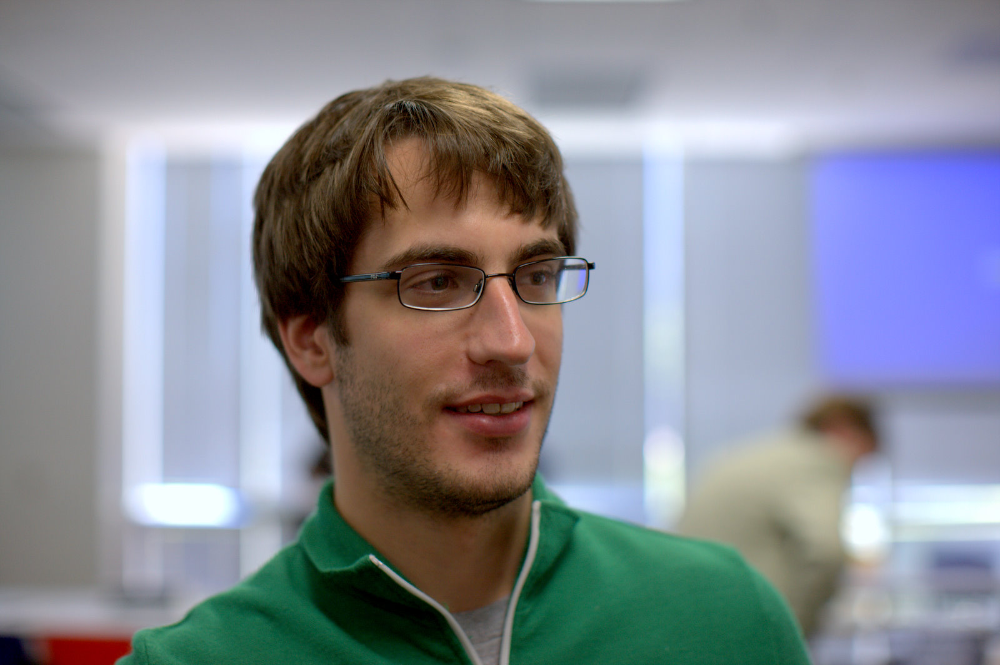
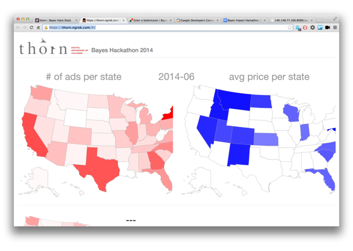
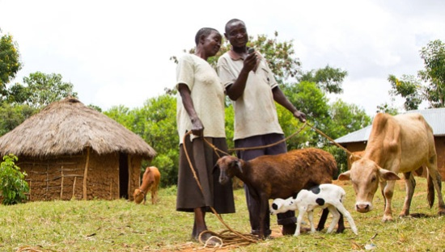
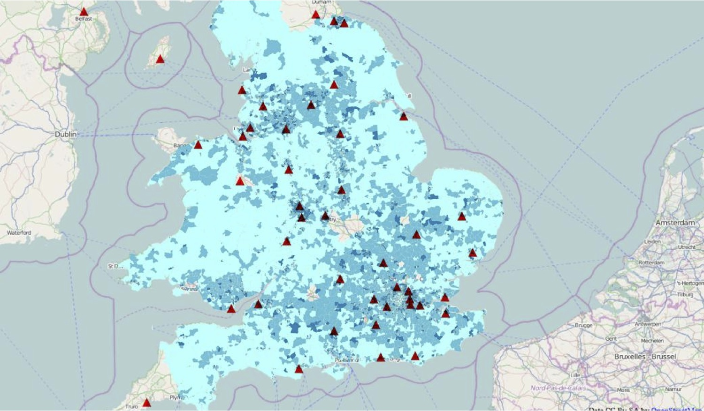
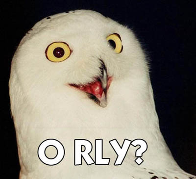

slidenumbers: true

# _Data Science_
## _for_
# _Social Good_

---

> The best minds of my generation are thinking about how to make people click ads. That sucks.
-- Jeff Hammerbacher (Co-founder Facebook)

^ now cloudera

---

## Social organizations need to allocate scarce resources for maximum impact

---

- predicting where services _will_ be needed
- prioritizing resources based on expected impact
- forecasting trends and changes
- identifying supporters likely to donate

---

# [fit] Basically regression problems

^ Given enough data

---

### Social organizations often don’t have
# [fit] data scientists

---

## [fit] What if data scientists would
# [fit] donate
## [fit] their skills?

---

This is already happening...[^*]

[^*]: ...but not so much in Germany

---

## A guided tour through the
# [fit] Data Science for Social Good
## movement

---

# DSSG Fellowship

- supported by the Eric & Wendy Schmidt Foundation
- 6 month fellowship
- currently in 3rd year (started 2013)
- Partners: NGOs, Governments

[http://dssg.io/](http://dssg.io/)

^ started by Rayid Ghani (Obama’s Chief data scientist)

---

# Examples (project headline copy&paste)

- _World Bank Group_ – Prediction & Identification of Collusion in International Development Projects
- _Chicago Public Schools_ – Student Enrollment Prediction for Budget Allocation
- _Pecan Street , WikiEnergy_ – Building Open Source Tools to Analyze Smart Meter Data

---

# More examples

visit [http://dssg.io/projects/](http://dssg.io/projects/)

---

# DSSG Atlanta

- like DSSG Chicago
- mainly funded by Oracle and Georgia Tech
- started 2014 (one year after Chicago)

[http://dssg-atl.io/](http://dssg-atl.io/)

---

# DSSG Washington

- University of Washington just announced their DSSG Summer Program

[http://escience.washington.edu/what-we-do/data-science-for-social-good](http://escience.washington.edu/what-we-do/data-science-for-social-good)

---

# Bayes Impact (YC-backed)

Bayes Impact is a nonprofit that deploys data scientists to solve big social problems with civic and nonprofit organizations

- founded 2014
- started as (full-time-)fellowship
- now hiring long-term employees

---

# Examples (project headline copy&paste)

- Increasing Graduation Rate And Optimizing Class Offerings For _UC Riverside_
- Improving Outcomes For Emotionally And Behaviorally Challenged Children With _Youth Villages_
- Stratification Of Parkinson's Disease Patients
- Optimizing Ambulance Response Times In Sf

---

# Bayes Hack Nov 15th

One weekend,
impact the world

[http://bayeshack.challengepost.com/submissions](http://bayeshack.challengepost.com/submissions)

^ curious to see how many will be alive in 6 months
^ image on right shows winner

---

# drivendata

- started this year (2014)
- currently 4 open competitions

[http://www.drivendata.org/](http://www.drivendata.org/)

^ https://www.kaggle.com/c/kdd-cup-2014-predicting-excitement-at-donors-choose
^ donors choose lets teachers enter projects for crowdfunding

---

# [fit] more opportunities to get involved

#### [http://blog.datalook.io/definitive-guide-data-science-good/](http://blog.datalook.io/definitive-guide-data-science-good/)

---

# Data__Kind__

> We're tackling the world's biggest problems
	through data science.
-- [http://www.datakind.org](http://www.datakind.org)

DataKind connects charities with data scientists by organizing two-day data dives where those data scientists help solve the charities’ data problems.

---

[Jake Porway at TEDxMontreal](https://www.youtube.com/watch?v=fZ3xXXeVrIQ)

---

# [fit] Examples

---

## Analyzing poverty through satellite imagery

[DataKind](http://www.datakind.org/) helped [GiveDirectly](https://www.givedirectly.org/) – an NGO making unconditional cash transfers to poor households via mobile phones in Kenia and Uganda[^1] – to identify especially needy villages through satellite image analysis[^2].

[^1]: [http://www.ted.com/talks/joy_sun_should_you_donate_differently](http://www.ted.com/talks/joy_sun_should_you_donate_differently)

[^2]: [http://www.datakind.org/projects/using-the-simple-to-be-radical/](http://www.datakind.org/projects/using-the-simple-to-be-radical/)

^ predictive model to estimate number of roofs
^ and percentage of thatched / metal roofs
^ crowdsourced training data
^ template matching
^ 100 person days of manual effort saved

---

# [fit] View the [presentation](https://www.youtube.com/watch?v=CxENxESpBtk)
# [fit] or read the [paper](http://ssg.mit.edu/~krv/pubs/AbelsonVS_kdd2014.pdf)

---

## Early warning system for human rights abuses

To help prioritize the many calls for help reaching Amnesty International’s Urgent Action Network DataKind volunteers have created a predictive model that analyzes messages for potential escalation.[^3][^4]

[^3]: [http://www.datakind.org/projects/using-predictive-analytics-to-prevent-human-rights-abuses/](http://www.datakind.org/projects/using-predictive-analytics-to-prevent-human-rights-abuses/)

[^4]: [http://www.washingtonpost.com/business/on-it/amnesty-international-considers-using-big-data-to-predict-human-rights-violations/2013/11/22/3f4f1a1e-5388-11e3-a7f0-b790929232e1_story.html](http://www.washingtonpost.com/business/on-it/amnesty-international-considers-using-big-data-to-predict-human-rights-violations/2013/11/22/3f4f1a1e-5388-11e3-a7f0-b790929232e1_story.html)

---

## Predicting demand for children’s hospices

Combining data from [Shooting Star Chase](http://www.shootingstarchase.org.uk/), public data about the hospice and healthcare sector and demographic data DataKind volunteers calculated predicted demand against hospice capacity to reveal areas of possible shortage.[^5]

[^5]: [http://www.datakind.org/finding-30000-missing-children/](http://www.datakind.org/finding-30000-missing-children/)

^ + a few other things

---

Most of DataKinds projects have been tackled by volunteers on 2-day data dives.

---

## What’s a
# [fit] Data Dive?

^ Who has been on a data dive?

---

# Before: Preparation of the data
#### (by voluntary data ambassadors in collaboration with the challenge partner – starting ~2 month before the data dive)
- anonymization/pseudonymization
- cleaning/fixing
- ensuring proper (machine readable) data formats

---

## Before:
# Preparation of the questions

---

> Any data scientist worth their salary will tell you that you should start with a question, NOT the data.
-- Jake Porway in [https://hbr.org/2013/03/you-cant-just-hack-your-way-to/](https://hbr.org/2013/03/you-cant-just-hack-your-way-to/)

---

# The Data Dive

- Challenge partners pitch their problems
- Volunteers create analyses, models and visualizations (led by data ambassadors) in two intense days of hacking
- solutions are being presented at the end

^ Big community event
^ Data Ambassadors important

---

## Aftermath:
# Implementation

#### Social organizations still don’t have the expertise: data ambassadors must help implement the solutions

^ Not yet quite clear to me
^ Sent DataKind and email to clarify

---

## Aftermath:
# Impact Analysis

#### Did it help at all?

^ Not yet quite clear to me

---

There is currently no organization in Germany comparable to DataKind.

---

There is currently no organization in Germany comparable to DataKind.

---

---

---

# We want to start the
# [fit] __Data Science for Social Good__
# Movement in Germany

---

# Who we are?

- Daniel Kirsch
- Marit Brademann
- Jana Kludas
- Richard Lawrence
- Georg Walther

^ Detexify, Co-founded OK Lab Münster

---

# Supporters

- Klaas Bollhöfer,
__Chief Data Scientist__
@ The Unbelievable Machine Company
- Adam Drake,
__Chief Data Officer__ @ Skyscanner
- Dr. Alexander Weiß 
__Head of Data Analytics__ @ Trademob

---

# What we need

---

# We need data ambassadors
## (how DataKind calls them)

- to prepare data before data dives
- lead teams at data dives
- help with the implementation afterwards

---

# We need problems

The international of the __Data Science for Social Good__-movement shows that data scientists are eager to donate their skills.

Social organizations need to understand how we can help them. Are you in contact with NGOs? Spread the word!

---

# Contact

http://dssg-berlin.org/
[@dssgber](http://twitter.com/dssgber)

Daniel Kirsch
[mail@danielkirs.ch](mailto:mail@danielkirs.ch)

---

# [fit] _Thank you!_
# [fit] _Questions?_

---

# Links:

- [http://datakind.org](http://datakind.org)
- [http://dssg.io](http://dssg.io)
- [http://dssg-atl.io](http://dssg-atl.io)
- [http://bayesimpact.org](http://bayesimpact.org)
- [http://codefor.de](http://bayesimpact.org)
- [http://datalook.io](http://datalook.io)

---

# Attribution

- [Foto of Jeff Hammberbacher](https://www.flickr.com/photos/fcb/2591501602/in/photolist-4X1897-47avxA-4mkQWN-4mcCAz-4mgFps-bJvpt-6ufucT-4mt3dH-4mt3f8-4mkQWs-e5vYVa-hDRfn3-aiEwhm-oTgPeV-ebcivP-aiEwhG-htuLv1-htt3k2-htsTSG-htsUwC-aiEx4b-aiEuqd-aiEuq5-ebhZis-ebckeK-dzVz9n-9LAV7P-7gFetg-7gFeuD-6zu5ed-7gFetx) by [Fred Brenenson](https://www.flickr.com/photos/fcb/) licensed under [CC BY 2.0](https://creativecommons.org/licenses/by/2.0/)
