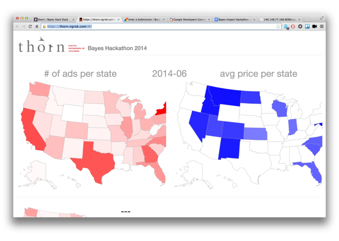

slidenumbers: true

# _Data Science_
## _for_
# _Social Good_

---

> The best minds of my generation are thinking about how to make people click ads. That sucks.
-- Jeff Hammerbacher (Co-founder Facebook)

---

## Social organizations need to allocate scarce resources for maximum impact

---

- identifying supporters likely to donate
- predicting where services _will_ be needed
- predicting impact of campaigns
- forecasting trends and changes

---

# [fit] Basically regression problems

---

### Social organizations often don’t have
# [fit] data scientists

---

## [fit] What if data scientists would
# [fit] donate
## [fit] their skills?

---

This is already happening...[^*]

[^*]: ...but not in Germany (afaik)

---

## A guided tour through the
# [fit] Data Science for Social Good
## movement

---

# DSSG Fellowship

- supported by the Eric & Wendy Schmidt Foundation
- 6 month fellowship
- taking applications for 3rd year
- Partners: NGOs, Governments

[http://dssg.io/](http://dssg.io/)

^ started by Rayid Ghani (Obama’s Chief data scientist)

---

# DSSG Example

Partner: [Nurse-Family Partnership](http://www.nursefamilypartnership.org/)

http://dssg.uchicago.edu/2014/08/27/nfp-undefinable-unmeasurable.html

^ 19 years ago RCTs to measure success
^ now rolled out to all over US
^ RCTs would be expensive
^ first year: compare enrolled mothers to counterfactual population
^ second year: define success metrics
^ success = mothers leave the program? Stay whole 2,5 years?

---

# DSSG Atlanta

[http://dssg-atl.io/](http://dssg-atl.io/)

---

# Bayes Impact (YC-backed)

Bayes Impact is a nonprofit that deploys data scientists to solve big social problems with civic and nonprofit organizations

- 12-month [Fellowship](http://www.bayesimpact.org/fellowship)
- Example project: [Dispatch-optimization for emergency responders](http://www.bayesimpact.org/projects/dispath-optimization-for-emergency-responders)

---

# Bayes Hack Nov 15th

[http://bayeshack.challengepost.com/submissions](http://bayeshack.challengepost.com/submissions)

---

# Thorn Fellowship

[http://www.wearethorn.org/thorn-innovation-lab/](http://www.wearethorn.org/thorn-innovation-lab/)

^ What do they do?

---

# _driven_data

http://www.drivendata.org/

(https://www.kaggle.com/c/kdd-cup-2014-predicting-excitement-at-donors-choose)

---

# KDD 2014
had a
# [Workshop on Data Science for Social Good](http://dssg.uchicago.edu/kddworkshop/)

---

# DataKind

> We're tackling the world's biggest problems
	through data science.
-- [http://www.datakind.org](http://www.datakind.org)

DataKind connects charities with data scientists by organizing two-day data dives where those data scientists help solving the charities’ data problems.

---

[Jake Porway at TEDxMontreal](https://www.youtube.com/watch?v=fZ3xXXeVrIQ)

---

## Analyzing poverty through satellite imagery

[DataKind](http://www.datakind.org/) helped [GiveDirectly](https://www.givedirectly.org/) - an NGO, die bedingungslos Geld an bedürftige Haushalte in Kenia und Uganda überweist[^1] - geholfen, besonders arme Dörfer durch die automatisierte Analyse von Satellitenbildern zu identifizieren[^2].

[^1]: [http://www.ted.com/talks/joy_sun_should_you_donate_differently](http://www.ted.com/talks/joy_sun_should_you_donate_differently)

[^2]: [http://www.datakind.org/projects/using-the-simple-to-be-radical/](http://www.datakind.org/projects/using-the-simple-to-be-radical/)

^ predictive model to estimate number of roofs
^ and percentage of thatched / metal roofs
^ crowdsourced training data
^ template matching
^ 100 person days of manual effort saved

---

# [fit] View the [presentation](https://www.youtube.com/watch?v=CxENxESpBtk)
# [fit] or read the [paper](http://ssg.mit.edu/~krv/pubs/AbelsonVS_kdd2014.pdf)

---

## Early warning system for human rights abuses

Um zu helfen, die vielen Nachrichten, die über Amnesty Internationals Urgent Action Network eingehen, zu priorisieren, hat DataKind ein Vorhersagemodell erstellt, welches die Nachrichtentexte analysiert, um auf das Eskalationspotential der Situation zu schließen.[^3][^4]

[^3]: http://www.datakind.org/projects/using-predictive-analytics-to-prevent-human-rights-abuses/

[^4]: http://www.washingtonpost.com/business/on-it/amnesty-international-considers-using-big-data-to-predict-human-rights-violations/2013/11/22/3f4f1a1e-5388-11e3-a7f0-b790929232e1_story.html

---

## Analyse der geografischen Unterversorgung mit Hospizen

TODO[^5]

[^5]: http://www.datakind.org/finding-30000-missing-children/

---

Most of these projects have been tackled by volunteers on 2-day data dives.

---

## What’s a
# [fit] Data Dive?

---

# Vorher: Vorbereitung der Daten
#### (durch freiwillige Data Scientists in Zusammenarbeit mit der Organisation – Vorlauf bis zu zwei Monate)
- Anonymisierung/Pseudonymisierung
- Säuberung/Fehlerbereinigung
- Sicherstellen der Maschinenlesbarkeit der Daten-Formate

---

# Vorher: Vorbereitung der Fragestellung
Daten offenbaren nicht auf magische Weise ihre Geheimnisse. Die richtigen Fragen müssen vorher gestellt werden, damit eine Analyse beim Data Dive Antworten liefern kann.[^10]

[^10]: https://hbr.org/2013/03/you-cant-just-hack-your-way-to/

---

# Der Data Dive

- Definition von überprüfbaren Metriken
- Vorhersagemodelle
- Visualisierungen

---

# Nachher: Implementierung

TODO

---

# Nachher: Impact-Analyse

TODO

---

There is currently no organization in Germany comparable to DataKind. __We__ want to change that.

---

# Who we are?

---

# We

- Daniel Kirsch
- Marit Brademann
- You?

---

# Supporters

- Klaas Bollhöfer,
The Unbelievable Machine Company
- Adam Drake,
Chief Data Scientist, Zanox

---

# What we need

---

# We need problems

The international of the __Data Science for Social Good__-movement shows data scientists are eager to donate their skills.

---

# We need data ambassadors
## (how DataKind calls them)

To prepare data for data dives and help with the implementation afterwards

---

# Kontakt

Daniel Kirsch
[mail@danielkirs.ch](mailto:mail@danielkirs.ch)
[@kirel](http://twitter.com/kirel)

No website yet... Need a landing page? TODO

---

# Links:

- [http://www.nominettrust.org.uk/knowledge-centre/articles/big-data-and-social-organisations](http://www.nominettrust.org.uk/knowledge-centre/articles/big-data-and-social-organisations)
- http://datakind.org
- http://dssg.io
- http://bayesimpact.org
- https://www.facebook.com/notes/facebook-data-science/data-science-for-social-good/10152669477928859

---

# Attribution

- [Foto of Jeff Hammberbacher](https://www.flickr.com/photos/fcb/2591501602/in/photolist-4X1897-47avxA-4mkQWN-4mcCAz-4mgFps-bJvpt-6ufucT-4mt3dH-4mt3f8-4mkQWs-e5vYVa-hDRfn3-aiEwhm-oTgPeV-ebcivP-aiEwhG-htuLv1-htt3k2-htsTSG-htsUwC-aiEx4b-aiEuqd-aiEuq5-ebhZis-ebckeK-dzVz9n-9LAV7P-7gFetg-7gFeuD-6zu5ed-7gFetx) by [Fred Brenenson](https://www.flickr.com/photos/fcb/) licensed under [CC BY 2.0](https://creativecommons.org/licenses/by/2.0/)
