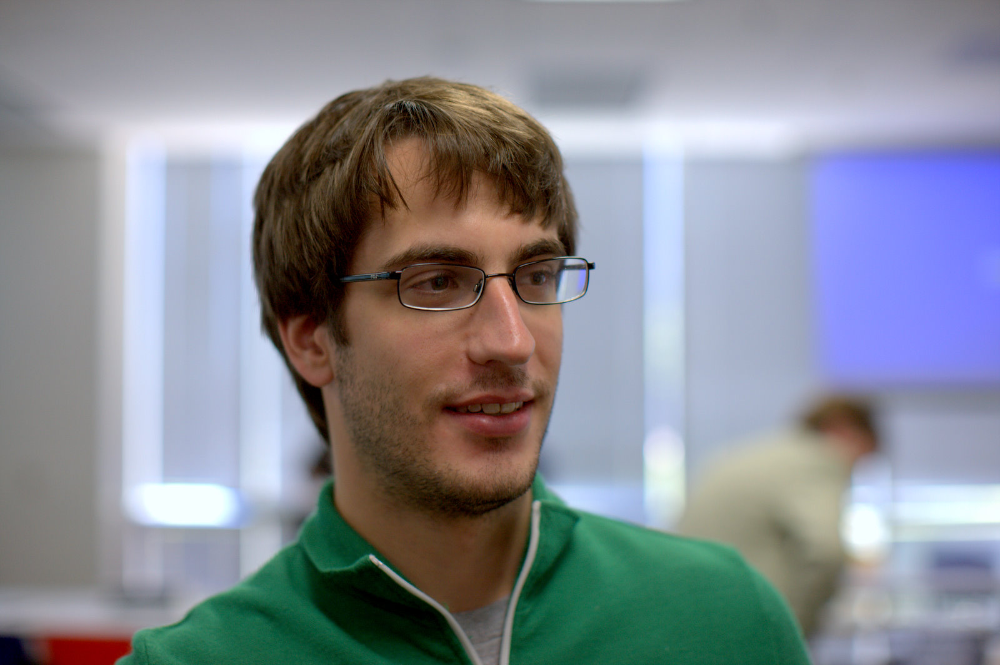
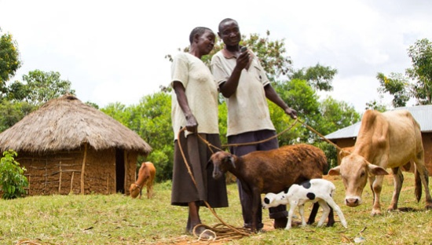

slidenumbers: true

# [fit] _Zivilgesellschaftliches Engagement_
## _mit_
# _Data Science_

---

# _Data Science_
## _for_
# _Social Good_

---

Diese Folien sollen NGOs erklären, was Data Science ist und wie sie davon profitieren können.

---

> The best minds of my generation are thinking about how to make people click ads. That sucks.
-- Jeff Hammerbacher (Mitbegründer Facebook)

---

### Wenn sich die Privatwirtschaft, die Mehrheit der klugen Köpfe angelt - wer arbeitet an den großen sozialen Problemen unserer Zeit?

---

## Idee:
#### Zivilgesellschaftliches Engagement mit
# _Data Science_

---

## Was ist
# _Data Science_?

---

---

# Data Science

> ist das **Ableiten von Erkenntnissen** aus **Daten**. [...] Es werden Techniken und Theorien aus vielen Bereichen der **Mathematik**, **Statistik**, **Informatik**, **Maschinellem Lernen**, [...] verwendet, aus denen praxisnahe und benutzerfreundliche Vorhersagemodelle entwickelt werden. [...]   
-- [http://en.wikipedia.org/wiki/Data_science](http://en.wikipedia.org/wiki/Data_science)

---

TODO

- Regressionsanalyse
- Klassifikation

---

#### Das klingt etwas abstrakt... zum Glück gibt es
# [fit] Beispiele

---

# DataKind

> We're tackling the world's biggest problems
	through data science.
-- [http://www.datakind.org](http://www.datakind.org)

DataKind bringt Wohltätigkeitsorganisationen auf zwei-tägigen Data Dives mit Data Scientists zusammen, die dort __pro bono__ an Datenproblemen der Organisationen arbeiten.

---

[Jake Porway at TEDxMontreal](https://www.youtube.com/watch?v=fZ3xXXeVrIQ)

---

## Analyse von Armut mit Satellitenbildern

[DataKind](http://www.datakind.org/) hat [GiveDirectly](https://www.givedirectly.org/) - einer NGO, die bedingungslos Geld an bedürftige Haushalte in Kenia und Uganda überweist[^1] - geholfen, besonders arme Dörfer durch die automatisierte Analyse von Satellitenbildern zu identifizieren[^2].

[^1]: [http://www.ted.com/talks/joy_sun_should_you_donate_differently](http://www.ted.com/talks/joy_sun_should_you_donate_differently)

[^2]: [http://www.datakind.org/projects/using-the-simple-to-be-radical/](http://www.datakind.org/projects/using-the-simple-to-be-radical/)

---

---

## Frühwarnsystem für Menschenrechtsverletzungen

Um zu helfen, die vielen Nachrichten, die über Amnesty Internationals Urgent Action Network eingehen, zu priorisieren, hat DataKind ein Vorhersagemodell erstellt, welches die Nachrichtentexte analysiert, um auf das Eskalationspotential der Situation zu schließen.[^3][^4]

[^3]: http://www.datakind.org/projects/using-predictive-analytics-to-prevent-human-rights-abuses/

[^4]: http://www.washingtonpost.com/business/on-it/amnesty-international-considers-using-big-data-to-predict-human-rights-violations/2013/11/22/3f4f1a1e-5388-11e3-a7f0-b790929232e1_story.html

---

## Analyse der geografischen Unterversorgung mit Hospizen

TODO[^5]

[^5]: http://www.datakind.org/finding-30000-missing-children/

---

Diese Projekte sind zum großen Teil von freiwilligen Data Scientists, die sonst bei Firmen wie Google, Facebook, Microsoft, uvm. arbeiten, an zwei-tägigen Data Dives umgesetzt worden.

---

## [fit] Das Muster

---

# Regressionsanalyse (Vorhersage)

- identifying supporters likely to donate
- Frühwarnsysteme
- Ressourcen-Vorsortierung (Ranking)
- Predicting where services _will_ be needed
- (Trends und Änderungen vorhersagen)

TODO

---

# Klassifikation

TODO

---

# [fit] Finden außergewöhnlicher Datenpunkte
## (Outlier detection)

TODO

---

## Wie funktioniert ein
# [fit] Data Dive?

---

# Vorher: Vorbereitung der Daten
#### (durch freiwillige Data Scientists in Zusammenarbeit mit der Organisation – Vorlauf bis zu zwei Monate)
- Anonymisierung/Pseudonymisierung
- Säuberung/Fehlerbereinigung
- Sicherstellen der Maschinenlesbarkeit der Daten-Formate

---

# Vorher: Vorbereitung der Fragestellung
Daten offenbaren nicht auf magische Weise ihre Geheimnisse. Die richtigen Fragen müssen vorher gestellt werden, damit eine Analyse beim Data Dive Antworten liefern kann.[^10]

[^10]: https://hbr.org/2013/03/you-cant-just-hack-your-way-to/

---

# Der Data Dive

- Definition von überprüfbaren Metriken
- Vorhersagemodelle
- Visualisierungen

---

# Nachher: Implementierung

TODO

---

# Nachher: Impact-Analyse

TODO

---

# [fit] Klingt toll! Und auch noch kostenlos...
# [fit] Wo kann ich unterschreiben?

---

Noch gibt es leider keine Organisation in Deutschland, die diese Art von Hackathon organisiert. Das wollen __wir__ ändern.

# Wer sind wir?

---

# Wir

- Daniel Kirsch, Diplom-Mathematiker, Berlin
- Marit Brademann
- Du?

---

# Unsere Unterstützer

- Klaas Bollhöfer,
The Unbelievable Machine Company
- Adam Drake,
Chief Data Scientist, Zanox

---

# Was wir brauchen

---

# Wir brauchen Probleme

Aus dem Erfolg der __Data Science for Social Good__-Bewegung in den USA und England (und seit Oktober auch in Indien, Irland, und Singapur) lässt sich ableiten, dass es kein Problem sein wird, Data Scientists zu mobilisieren.

Was uns fehlt sind __NGOs__, die bessere Einsichten aus ihren __Daten__ ziehen wollen.

---

# Kontakt

TODO

---

# Weiterführende Links:

- [http://www.nominettrust.org.uk/knowledge-centre/articles/big-data-and-social-organisations](http://www.nominettrust.org.uk/knowledge-centre/articles/big-data-and-social-organisations)
- http://datakind.org

---

Weitere Beispiele (rauswerfen?)

- http://www.bayesimpact.org/projects/dispath-optimization-for-emergency-responders

---

# Attribution

- [Foto von Jeff Hammberbacher](https://www.flickr.com/photos/fcb/2591501602/in/photolist-4X1897-47avxA-4mkQWN-4mcCAz-4mgFps-bJvpt-6ufucT-4mt3dH-4mt3f8-4mkQWs-e5vYVa-hDRfn3-aiEwhm-oTgPeV-ebcivP-aiEwhG-htuLv1-htt3k2-htsTSG-htsUwC-aiEx4b-aiEuqd-aiEuq5-ebhZis-ebckeK-dzVz9n-9LAV7P-7gFetg-7gFeuD-6zu5ed-7gFetx) von [Fred Brenenson](https://www.flickr.com/photos/fcb/) lizensiert unter [CC BY 2.0](https://creativecommons.org/licenses/by/2.0/)
