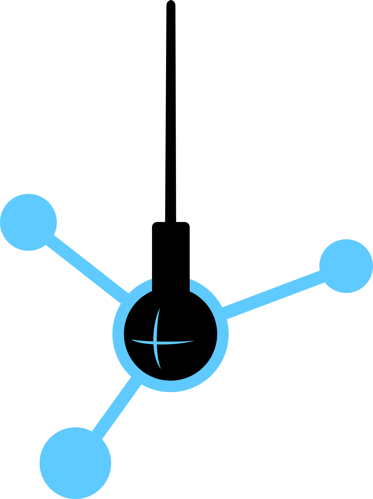
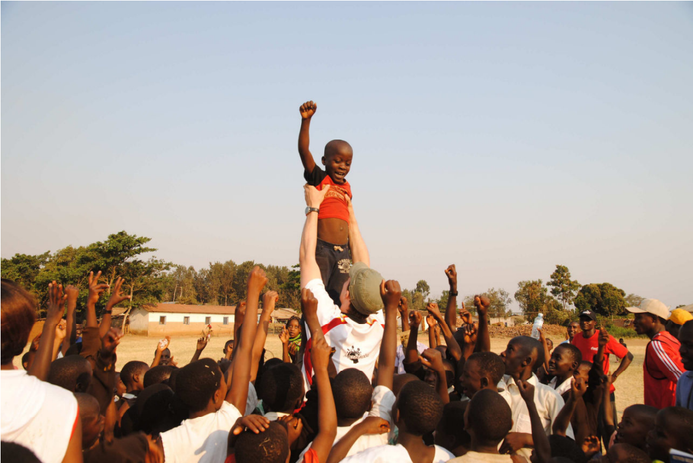
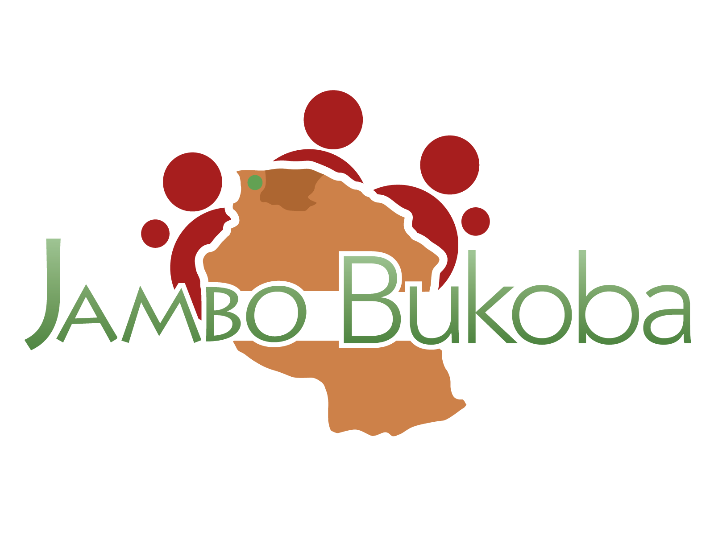
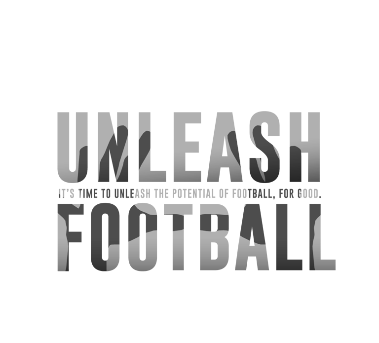
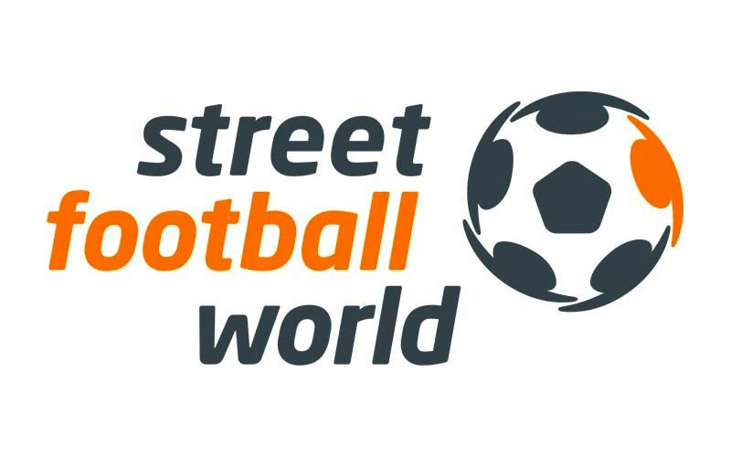

slidenumbers: true

# Data Science for Social Good Berlin

### _sponsoring opportunities_

---

# We support nonprofits with
# data science

### We partner up mission-driven organizations and experts in data science to find solutions for social problems.

## _Pro bono._

---

# Data are the new oil. NPOs run on coal.

Data science and predictive analytics are causing a lot of innovation in the private sector. Nonprofits lack technological progress. We want to close that gap and set the stage for data scientists to contribute their expertise.

Our vision is an impact oriented and data informed society.

---

# Project path

1. _Screening_ of NPOs & volunteers
2. Selection of NPOs and _matching_ with volunteers
3. Two- to three-month _preparation_ (problem definition, cleaning and joining of data sources)
4. _Data Dive_ – finding solutions with the support of the data science community
5. follow-up & implementation

---

# Data Dive as pinnacle of projects

At a weekend event the data science community partners up with our selected NPOs to solve their data problems collaboratively.

The event creates attention among data scientists and social organizations alike and enables wide participation.

It’s free for data scientists.

---

# The first Data Dive is already planned

It’s happening on October 24-25, 2015.

We will help two nonprofit organisations:
_Jambo Bukoba_ and _Streetfootballworld_.

Our volunteers are currently preparing the data.

---

[Jambo Bukoba](http://www.jambobukoba.com/) committed itself to empower children in Tanzania through sports. The program offers perspectives and encourages children to improve their academic achievements. Additionally it educates about HIV/AIDS.

__DSSG Berlin will help to visualize the impact of the program with open data and internal data to inform perspectives on future expansion.__

---

[Streetfootballworld](http://www.streetfootballworld.org/) is an international umbrella organization for nonprofits in the field of social change through football.

With [http://www.unleashfootball.com](http://www.unleashfootball.com) they want to collect more than 100.000 ideas on the question _„How can we make the greatest game a greater source for good?“_.

__DSSG will help to gain insights from these thousands of answers (e.g. through NLP and topic models).__

---

To be able to harvest the positive impact, we need partners that carry the cost of the Data Dives. Costs include the venue, equipment and catering for the data scientists.

# [fit] If you share our vision, jump on board and support us!

---

# Benefits for your company

- Place your brand in an expert community of data scientists
- Invest in an emerging market - _big data_ and _data science_ will become increasingly important for NPOs
- Take social responsobility and help to change the world - with _Data Science_

---

# Sponsoring opportunities

---

# Venue sponsoring

You have room for

- 50-100 persons (in working groups of 10), catering, presentations
- stable, fast internet connection (for 50-100 people!), presentation equipment (projector, mic, etc.)

Become our venue sponsor! You get maximum visibility and will speak for 5 minutes during the event’s intro talks.

---

# General sponsoring

- __Gold__ – Prominent logo on the poster, 5m slot during intro talks, sponsored breakout session[^1], mention in press releases and blog posts – 2000€
- __Silver__ – logo on the poster, sponsored breakout session[^1]  – 1000€
- __Bronze__ – small logo on the poster – 200€

Not the right package for you? Talk to us!

[^1]: 30 minutes presentation on a relevant method or technology

---

# Team

- Daniel Kirsch _(Math Diploma)_
- Jana Kludas _(PhD Machine Learning)_
- Marit Brademann _(MSc Social Science)_
- Richard Lawrence _(MSc Biomedical Engineering)_
- Georg Walther _(PhD Computational Biology)_
- Patrick Baier _(MSc Information Systems)_

---

# Advisory Board

- Claudia Leißner, __CEO__ @ Proboneo
- Klaas Bollhöfer,
__Chief Data Scientist__ @ The Unbelievable Machine Company
- Adam Drake, __Chief Data Officer__ @ Skyscanner
- Dr. Alexander Weiß, __Head of Data Analytics__ @ Trademob
- Tobias Pfaff, __CEO__ @ Datalook

---

# Contact

### Daniel Kirsch
### [daniel@dssg-berlin.org](mailto:daniel@dssg-berlin.org)
### Tel. +49 151 15729370
### [http://dssg-berlin.org](http://dssg-berlin.org)

