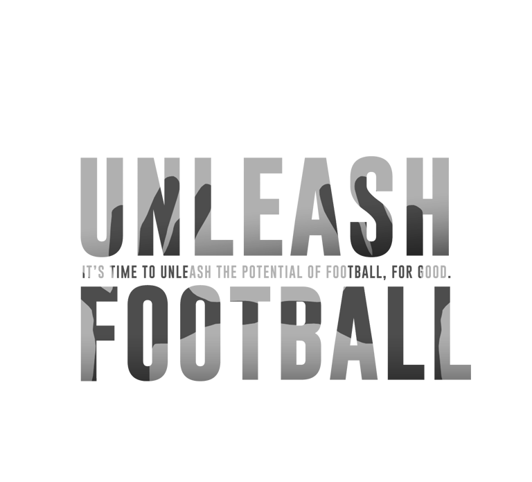

# Data Science for Social Good Berlin

### _Sponsorenmappe_

---

# Data Science for Social Good Berlin

### Wir machen soziale Organisationen auf den Wert ihrer Daten aufmerksam und ermöglichen die Unterstützung durch die Data Science-Community, um die Probleme unserer Zeit zu lösen.

### Wir vermitteln zwischen sozialen Organisationen und der Data Science-Community und führen spezielle Hackathons durch, in denen Lösungen für die identifizierten Probleme entstehen.

>_Pro bono._

---

# Warum?

Data Science und Predictive Analytics entfalten in der Privatwirtschaft enormes Innovationspotential. Non-Profits sind technologisch längst abgehängt. Wir wollen diese Lücke schließen und Data Scientists aus der Privatwirtschaft die Möglichkeit geben sich mit ihren Skills zivilgesellschaftlich zu engagieren.

Wir streben eine wirkungsorientierte und dateninformierte Gesellschaft an. 

---

# Erster Hackathon

Unser erster Hackathon findet am 24./25.10.2015 statt.

Dabei helfen wir den zwei Non-Profits Jambo Bukoba und Streetfootballworld.

Unsere freiwilligen Datenbotschafter arbeiten bereits an der Datenaufbereitung.

---

[Jambo Bukoba](http://www.jambobukoba.com/) setzt sich dafür ein, Kinder in Tansania durch Sport zu starken Menschen zu machen. Das Programm zeigt den Kindern Ziele auf, spornt sie zu besseren schulischen Leistungen an und klärt zudem über HIV/Aids auf.

__DSSG Berlin wird dabei helfen mit offenen Daten der Weltbank und internen Daten von Jumbo Bukoba die Wirksamkeit des Programms zu visualisieren und Potentiale für eine zukünftige Ausweitung aufzuzeigen.__

---

[Streetfootballworld](http://www.streetfootballworld.org/) ist eine internationale Dachorganisation für Non-Profits die sozialen Wandel durch Fußball bewirken.

Mit [http://www.unleashfootball.com](http://www.unleashfootball.com) wollen sie über 100.000 Antworten auf die Frage _„How can we make the greatest game a greater source for good?“_ sammeln.

__DSSG wird dabei helfen Einsichten aus diesen riesigen Textmengen zu gewinnen.__

---

Unsere Hackathons stiften Nutzen aber kosten auch Geld. Die Kostenpunkte beinhalten den Veranstaltungsort, die Technik und die Verpflegung für die Data Scientists. Darum brauchen wir Ihre Unterstützung.

# [fit] Wir suchen Partner, die unsere Vision teilen.

---

# Nutzen für Ihr Unternehmen 

- Identifikation mit dem Trend _Data Science_ in einem neuen (gemeinwohlorientierten) Kontext
- Investition in einem sich entwickelnden Markt - _Big Data_ und _Data science_ werden zunehmend relevanter für NPOs
- Interaktion mit Data Scientists die über den Tellerrand schauen wollen
- Sie helfen die Welt zu verbessern — mit _Data Science_

---

# Möglichkeiten der Unterstützung

---

# Venue Sponsoring

Sie haben

- Platz für 50-100 Personen
- stabiles, schnelles Internet
- __TODO__

dann werden Sie Venue-Sponsor! Sie bekommen außerdem einen 5 Minuten-Slot bei der Begrüßung. __TODO__

---

# Sponsor für’s Catering

Werden Sie Sponsor für eine der Mahlzeiten. 

- Frühstück Tag 1
- Mittagessen Tag 1
- Abendessen Tag 1
- Frühstück Tag 2

Sie werden im Zeitplan und bei der Ankündigung der Mahlzeit genannt.

---

# Generelles Sponsoring

Sie decken unsere sonstigen Kosten für Organisation und Materialien wie Getränke, Poster, Präsentationstechnik, etc.

- __Gold__ – Prominentes Logo auf dem Poster, 5m Slot bei der Begrüßung, Erwähnung im Bericht im Blog __TODO__
- __Silver__ – Logo auf dem Poster __TODO__
- __Bronze__ – kleines Logo auf dem Poster __TODO__

---

# Team

- Daniel Kirsch (Diplom-Mathematiker)
- Jana Kludas (Phd Machine Learning)
- Marit Brademann (MSc Social Science)
- Richard Lawrence (MSc Biomedical Engineering)
- Georg Walther (PhD Computational Biology)
- Patrick Baier (MSc Information Systems)

---

# Advisory Board

- Claudia Leißner, __Geschäftsführerin__ @ Proboneo
- Dr. Alexander Weiß, __Head of Data Analytics__ @ Trademob
- Klaas Bollhöfer,
__Chief Data Scientist__ @ The Unbelievable Machine Company
- Tobias Pfaff, __Geschäftsführer__ @ Datalook
- Adam Drake, __Chief Data Officer__ @ Skyscanner

---

# Kontakt

### Daniel Kirsch
### [daniel@dssg-berlin.org](mailto:daniel@dssg-berlin.org)
### Tel. +49 151 15729370
### [http://dssg-berlin.org](http://dssg-berlin.org)

