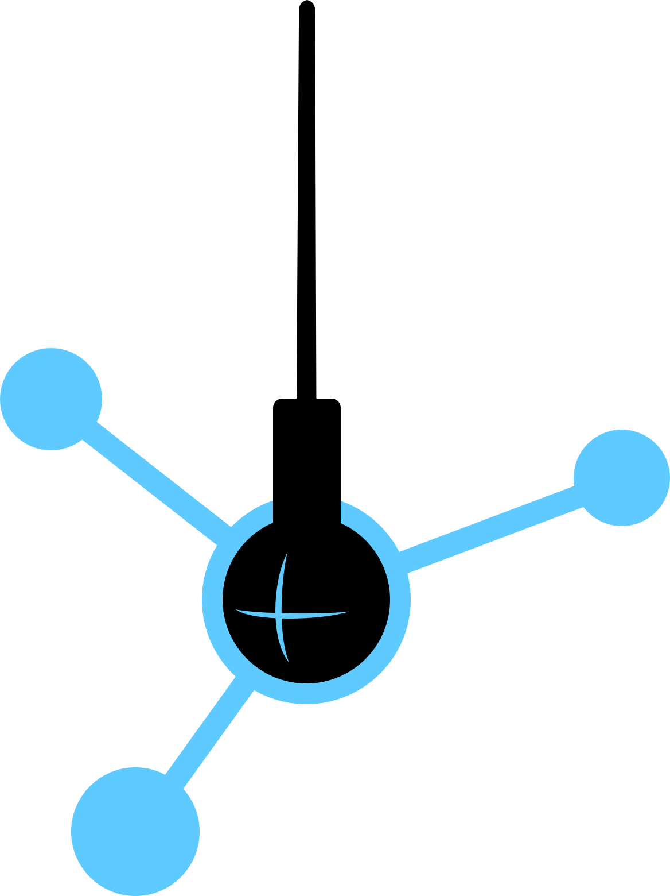
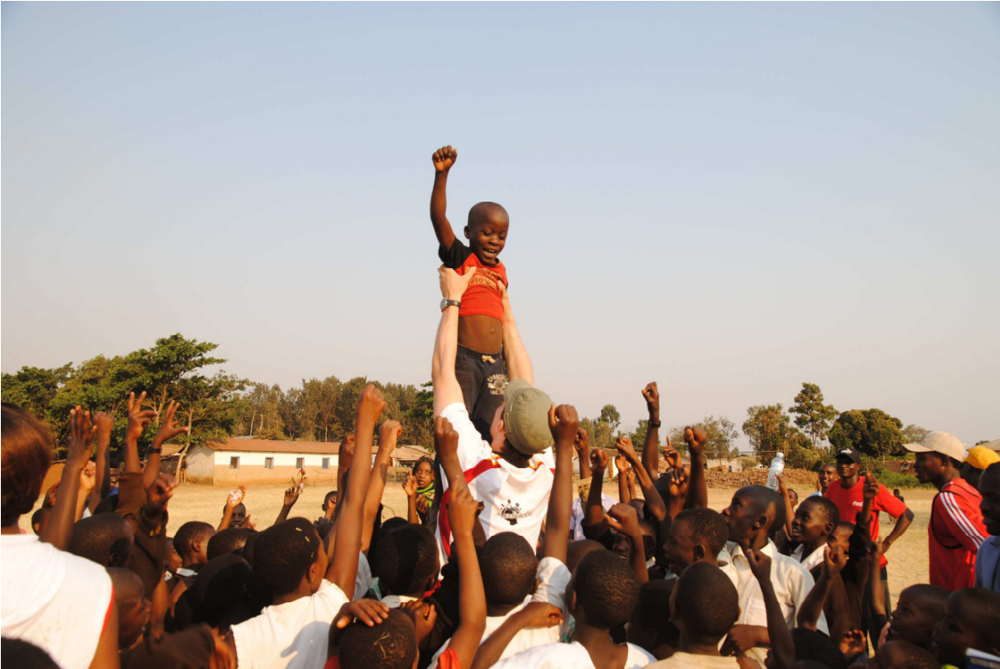
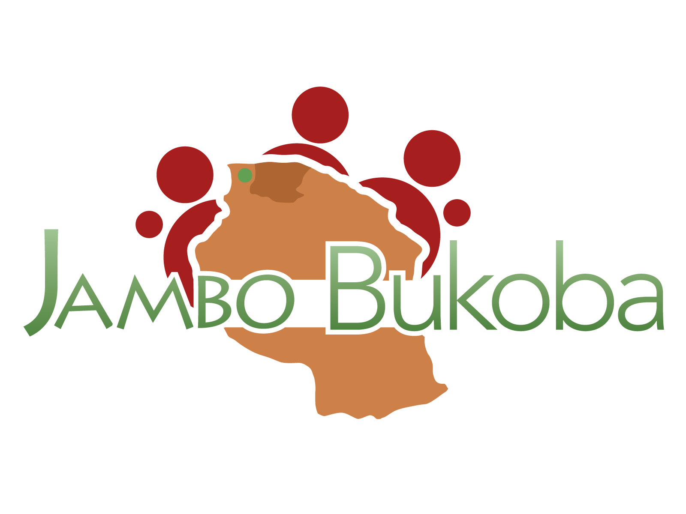
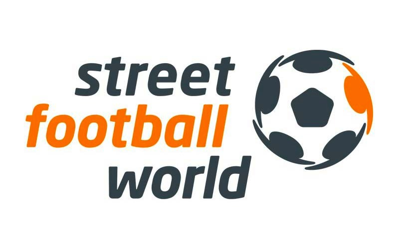

slidenumbers: true

# Data Science for Social Good Berlin

### _Sponsorenmappe_

---

# Non-Profits unterstützen mit
# Data Science

### Wir vermitteln zwischen sozialen Organisationen und Data Science-Experten um Lösungen für soziale Probleme zu finden.

## _Pro bono._

---

# Daten sind das neue Öl. NPOs heizen mit Kohle.

Data Science und Predictive Analytics entfalten in der Privatwirtschaft enormes Innovationspotential. Non-Profits sind technologisch längst abgehängt. Wir wollen diese Lücke schließen und Data Scientists die Möglichkeit geben, sich mit ihrer Expertise zivilgesellschaftlich zu engagieren.

Wir streben eine wirkungsorientierte und dateninformierte Gesellschaft an.

---

# Projektablauf

1. _Screening_ von NPOs & Freiwilligen
2. Auswahl von NPOs und _matching_ mit Freiwilligen
3. Zwei- bis dreimonatige _Vorbereitung_ (Problemdefinition, Datensäuberung, verbinden von Datenquellen)
4. _Data Dive_ – finden von Lösungen mit Unterstützung der Data Science-Community
5. Nachbereitung & Implementierung

---

# Data Dive als Höhepunkt von Projekten

Bei einem Wochenendevent trifft die Data Science-Community auf unsere ausgewählten NPOs, um gemeinsam mit ihnen deren Datenprobleme anzugehen.

Der Eventcharakter erzeugt Aufmerksamkeit bei Data Scientists und sozialen Organisationen und ermöglicht eine breite Teilhabe.

Das Event ist für Data Scientists kostenlos.

---

# Erster Data Dive bereits in Vorbereitung

Unser erster Data Dive findet am 24./25.10.2015 statt.

Dabei helfen wir zwei Non-Profit-Organisationen:
_Jambo Bukoba_ und _Streetfootballworld_.

Die Vorbereitungen unserer Freiwilligen haben bereits begonnen.

---

[Jambo Bukoba](http://www.jambobukoba.com/) setzt sich dafür ein, Kinder in Tansania durch Sport zu starken Menschen zu machen. Das Programm zeigt den Kindern Ziele auf, spornt sie zu besseren schulischen Leistungen an und klärt zudem über HIV/Aids auf.

__DSSG Berlin wird dabei helfen mit offenen Daten der Weltbank und internen Daten von Jumbo Bukoba die Wirksamkeit des Programms zu visualisieren und Potentiale für eine zukünftige Expansion aufzuzeigen.__

---

[Streetfootballworld](http://www.streetfootballworld.org/) ist eine internationale Dachorganisation für Non-Profits die sozialen Wandel durch Fußball bewirken.

Mit [http://www.unleashfootball.com](http://www.unleashfootball.com) wollen sie über 100.000 Antworten auf die Frage _„How can we make the greatest game a greater source for good?“_ sammeln.

__DSSG wird dabei helfen (z.B. mit NLP und Topic Modeling) Einsichten aus den Tausenden von Antworten zu gewinnen.__

---

Unsere Projekte stiften Nutzen, doch speziell die Data Dives kosten auch Geld. Die Kostenpunkte beinhalten den Veranstaltungsort, die Technik und die Verpflegung für die Data Scientists. Darum brauchen wir Ihre Unterstützung.

# [fit] Wir suchen Partner, die unsere Vision teilen.

---

# Nutzen für Ihr Unternehmen 

- Platzieren Sie ihre Marke in einer Expertencommunity von Data Scientists
- Investieren Sie in einem sich entwickelnden Markt - _Big Data_ und _Data Science_ werden zunehmend relevanter für NPOs
- Übernehmen sie soziale Verantwortung und helfen Sie die Welt zu verbessern — mit _Data Science_

---

# Möglichkeiten der Unterstützung

---

# Venue Sponsoring

Sie haben Platz für

- 50-100 Personen (in Arbeitsgruppen von 10 Personen), Catering, Präsentationen
- stabiles, schnelles Internet (für 50-100 Personen!), Präsentationstechnik (Beamer, Mikro, etc.)

Werden Sie Venue-Sponsor! Sie erreichen maximale Sichtbarkeit und bekommen außerdem einen 5m-Slot bei der Begrüßung zum Event.

---

# Generelles Sponsoring

- __Gold__ – Prominentes Logo auf dem Poster, 5m Slot zur Begrüßung, Sponsored Breakout Session[^1], Nennung in Pressemitteilungen und Blogbeiträgen – 2000€
- __Silver__ – Logo auf dem Poster, Sponsored Breakout Session[^1]  – 1000€
- __Bronze__ – kleines Logo auf dem Poster – 200€

Nicht das Richtige dabei? Sprechen Sie uns an!

[^1]: 30m Talk über eine relevante Methodik oder Technologie

---

# Team

- Daniel Kirsch _(Diplom-Mathematiker)_
- Jana Kludas _(PhD Machine Learning)_
- Marit Brademann _(MSc Social Science)_
- Richard Lawrence _(MSc Biomedical Engineering)_
- Georg Walther _(PhD Computational Biology)_
- Patrick Baier _(MSc Information Systems)_

---

# Advisory Board

- Claudia Leißner, __Geschäftsführerin__ @ Proboneo
- Klaas Bollhöfer,
__Chief Data Scientist__ @ The Unbelievable Machine Company
- Adam Drake, __Chief Data Officer__ @ Skyscanner
- Dr. Alexander Weiß, __Head of Data Analytics__ @ Trademob
- Tobias Pfaff, __Geschäftsführer__ @ Datalook

---

# Kontakt

### Daniel Kirsch
### [daniel@dssg-berlin.org](mailto:daniel@dssg-berlin.org)
### Tel. +49 151 15729370
### [http://dssg-berlin.org](http://dssg-berlin.org)

